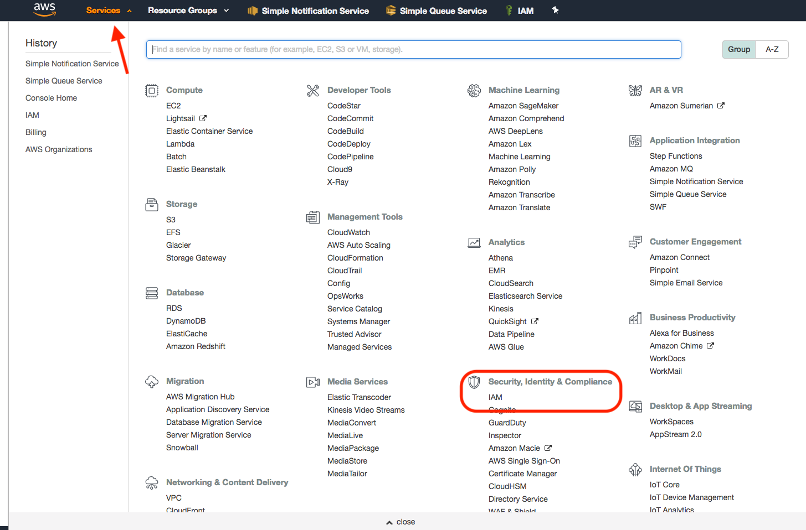
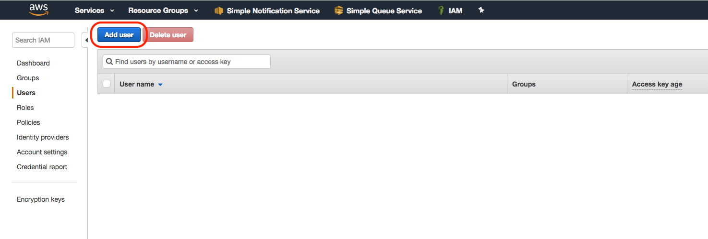
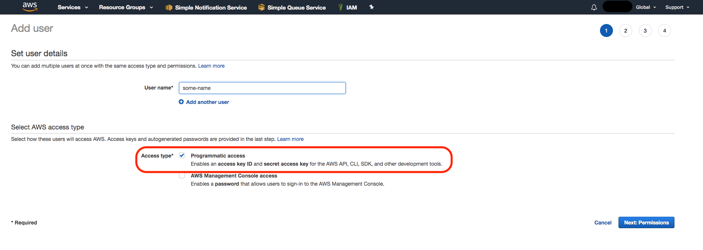
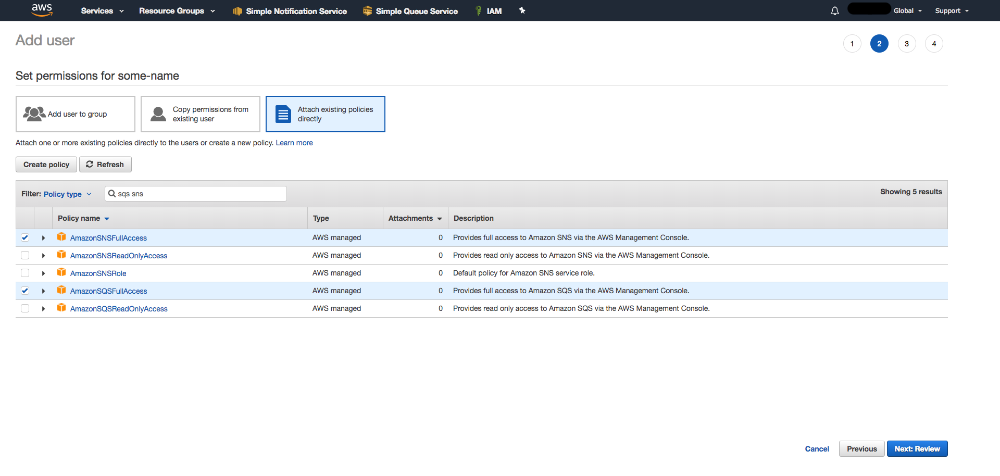
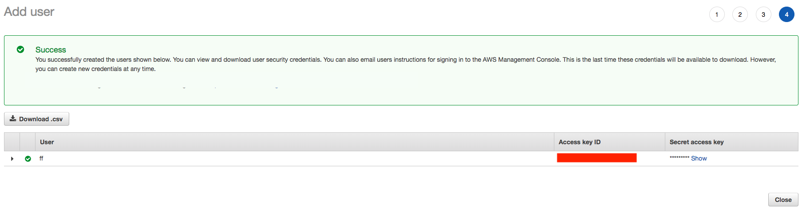
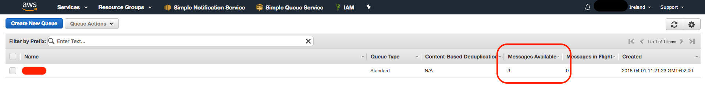

# Connecting Amazon SNS to Amazon SQS Queues

I want to share a very simple but working example of how to connect AWS SNS with AWS SQS using Node and 'aws-sdk'
We will set it up together to make it properly working on your machine (locally).
Here are the basic steps we need to take:
* setup the 2 services directly on AWS Console
* run the code locally

## AWS Admin Console
#### First step is setting up AWS properly from the Console
I highly suggest to follow this guide<br/>
Please write down your TopicArn for SNS and your QueueUrl for SQS during the process!<br/>
http://budiirawan.com/how-to-connect-amazon-sns-to-amazon-sqs-queues/
<br/>

Here is what you have done so far:
* Create SNS Topic
* Create SQS Queue
* Configure SQS Queue Permissions
* Create SQS Subscriber

Please make sure you can manually publish a message to the SNS topic you created, and consume it from the SQS queue!

#### We have now one more step:<br/>
Set up IAM User and give him access to SNS and SQS<br/>
Let's do it together:

* ##### Go to 'Services' and 'IAM'click on 'Add user'

<br/>
* ##### Click on 'Add user'

<br/>
* ##### Give the user 'Programmatic access', and move to 'Next: Permissions'

<br/>
* ##### Give the user full access to both AmazonSNS and AmazonSQS
#### *IMPORTANT! These permissions are fine only when running locally! User permissions must be changed in production environment!*

<br/>
* ##### Finally write down "Access Key Id" and "Secret Access Key" for the user. You need them later

<br/>
## Running locally

Clone the repo, install the dependencies and compile the typescript files
```
git clone git@github.com:L-oris/SNStoSQS.git
cd SNStoSQS
cp config.example.json config.json
yarn && yarn build
```

Write down your credentials into 'config.json' you just created
```
{
  "accessKeyId": "",
  "secretAccessKey": "",
  "region": "",
  "snsTopicArn": "",
  "sqsQueueUrl": ""
}
```

#### Setup finished!
------
#### Now you can publish and consume events by either 1- Running commands from the terminal or 2- Sending HTTP requests

1.  ##### Running commands from the terminal<br/>
These are the 2 scripts available
```
yarn publishEvent --message='Your custom message'

yarn consumeEvent
```
When publishing an event, you can pass the `--message` flag with your custom message, default is "Hello There"


2.  ##### Sending HTTP Requests
Turn on the server on port 3000
```
yarn start
```

Then send HTTP requests (using Postman for example) to these 2 endpoints
* POST http://localhost:3000/publish
You can write a custom message to the body of the POST request, following this format
```
{
  "message": "Your custom message"
}
```  
Otherwise "Hello There" is the default message
<br/>
* GET http://localhost:3000/consume

------

After sending some events (and before consuming them) you should be able to see some messages waiting in the queue


#### Final notes
The following code wants to be simple and easily understandable, as a quick-intro guide. It does not have proper error handling and test coverage for production environment!
